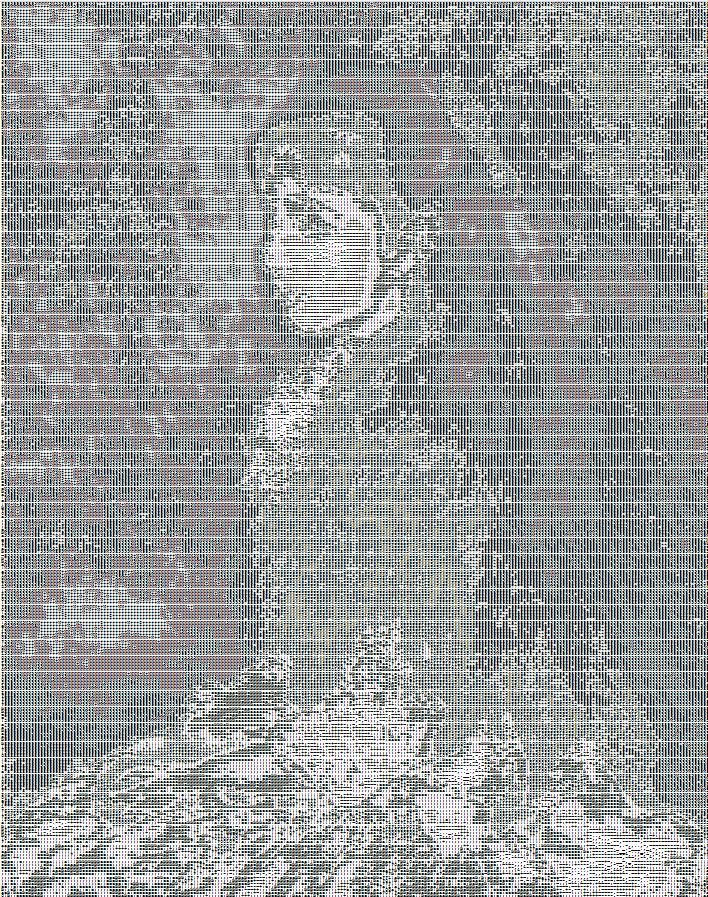

# Générateur d'Art ASCII

## Description

Il s'agit d'un générateur simple d'art ASCII qui convertit une image en art ASCII. Le générateur utilise une chaîne d'ombrage fournie pour mapper l'intensité des pixels sur des caractères ASCII.

## Fonctionnalités

- Téléchargement d'image et génération d'art ASCII
- Option d'inversion pour les arrière-plans plus sombres
- Fonctionnalité de zoom avant et de zoom arrière
- Chaîne d'ombrage personnalisable pour différentes intensités de caractères
- Résolution réglable pour des détails plus fins

## Comment Utiliser

1. Clonez le dépôt sur votre machine locale.
2. Ouvrez `index.html` dans un navigateur web.
3. Choisissez une image en utilisant l'entrée de fichier.
4. Cliquez sur le bouton "art generate".
5. Ajustez les paramètres et profitez de l'art ASCII !

## Captures d'écran

